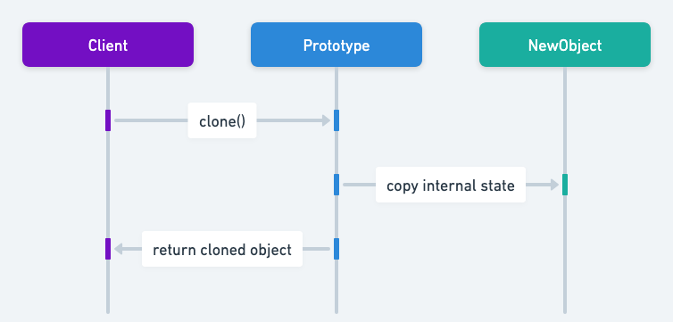

## 别称 

* 克隆

## 原型设计模式目的

原型模式用于通过一个原型实例来指定待创建对象的类型，并通过对象克隆的方式创建新实例。

## 原型模式的详细解释与真实案例

真实示例

> 试想有一家定制家具制造公司。该公司并未在每次收到订单时都从零开始制作家具，而是保留了最受欢迎设计的原型。当客户订购某一特定设计时，公司只需克隆该设计的原型，再进行必要的定制调整即可。这种方式节省了时间和资源，因为家具的基本结构和设计细节已预先确定，使公司能够快速完成订单，同时保证质量的一致性。
>
> 在这种场景下，家具原型就如同软件中的对象原型，支持基于现有模型高效创建定制化的新家具。

简单来说

> 通过克隆基于现有对象创建对象。

维基百科说

> 原型模式是软件开发中的一种创建型设计模式。当要创建的对象类型由原型实例决定时，可以使用原型模式，该实例被克隆以创建新的对象。

序列图



## Java 原型模式的编程示例

在 Java 中，建议按如下方式实现原型模式。首先，创建一个接口，其中包含一个用于克隆对象的方法。在本例中，`Prototype`接口通过其`copy`方法实现了这一点。

```java
public abstract class Prototype<T> implements Cloneable {
    @SneakyThrows
    public T copy() {
        return (T) super.clone();
    }
}
```

我们的示例包含不同生物的层次结构。例如，让我们看一下`Beast`和`OrcBeast`类别。

```java
@EqualsAndHashCode(callSuper = false)
@NoArgsConstructor
public abstract class Beast extends Prototype<Beast> {
  public Beast(Beast source) {}
}
```

```java
@EqualsAndHashCode(callSuper = false)
@RequiredArgsConstructor
public class OrcBeast extends Beast {

  private final String weapon;

  public OrcBeast(OrcBeast orcBeast) {
    super(orcBeast);
    this.weapon = orcBeast.weapon;
  }

  @Override
  public String toString() {
    return "Orcish wolf attacks with " + weapon;
  }
}
```

我们不想讨论太多细节，但完整的示例还包含基类`Mage`，并且`Warlord`有针对精灵和兽人的专门实现。

为了充分利用原型模式，我们创建`HeroFactory`并`HeroFactoryImpl`分类以从原型产生不同种类的生物。

```java
public interface HeroFactory {
  Mage createMage();
  Warlord createWarlord();
  Beast createBeast();
}
```

```java
@RequiredArgsConstructor
public class HeroFactoryImpl implements HeroFactory {

  private final Mage mage;
  private final Warlord warlord;
  private final Beast beast;

  public Mage createMage() {
    return mage.copy();
  }

  public Warlord createWarlord() {
    return warlord.copy();
  }

  public Beast createBeast() {
    return beast.copy();
  }
}
```

现在，我们能够通过克隆现有实例来展示生成新生物的完整原型模式。

```java
public static void main(String[] args) {
    var factory = new HeroFactoryImpl(
            new ElfMage("cooking"),
            new ElfWarlord("cleaning"),
            new ElfBeast("protecting")
    );
    var mage = factory.createMage();
    var warlord = factory.createWarlord();
    var beast = factory.createBeast();
    LOGGER.info(mage.toString());
    LOGGER.info(warlord.toString());
    LOGGER.info(beast.toString());

    factory = new HeroFactoryImpl(
            new OrcMage("axe"),
            new OrcWarlord("sword"),
            new OrcBeast("laser")
    );
    mage = factory.createMage();
    warlord = factory.createWarlord();
    beast = factory.createBeast();
    LOGGER.info(mage.toString());
    LOGGER.info(warlord.toString());
    LOGGER.info(beast.toString());
}
```

这是运行示例的控制台输出。

```
08:36:19.012 [main] INFO com.iluwatar.prototype.App -- Elven mage helps in cooking
08:36:19.013 [main] INFO com.iluwatar.prototype.App -- Elven warlord helps in cleaning
08:36:19.014 [main] INFO com.iluwatar.prototype.App -- Elven eagle helps in protecting
08:36:19.014 [main] INFO com.iluwatar.prototype.App -- Orcish mage attacks with axe
08:36:19.014 [main] INFO com.iluwatar.prototype.App -- Orcish warlord attacks with sword
08:36:19.014 [main] INFO com.iluwatar.prototype.App -- Orcish wolf attacks with laser
```

## 何时在 Java 中使用原型模式

* 当需要在运行时指定要实例化的类时，例如通过动态加载。
* 为了避免构建一个与产品类层次结构平行的工厂类层次结构。
* 当一个类的实例仅能拥有少数几种不同的状态组合时，安装相应数量的原型并克隆它们，可能会比每次都使用相应的状态去实例化该类更方便。
* 当对象创建的成本高于克隆成本时。
* 当需要实例化的具体类在运行时之前未知时。

## Java 原型模式的实际应用

* 在Java中，`Object.clone()`方法是原型模式的经典实现。
* GUI 库经常使用原型来创建按钮、窗口和其他小部件。
* 在游戏开发中，创建具有相似属性的多个对象（如敌方角色）。

## 原型模式的优点和缺点

优点：:

在 Java 应用程序中使用原型模式

* 可以隐藏实例化新对象的复杂性。
* 可以减少类的数量。
* 允许在运行时添加和删除对象。

缺点：

* 需要实施可能很复杂的克隆机制。
* 深度克隆可能难以正确实现，特别是当类具有带有循环引用的复杂对象图时。

## 相关 Java 设计模式

* [抽象工厂](https://java-design-patterns.com/patterns/abstract-factory/): 两者都涉及创建对象，但原型使用原型实例的克隆，而抽象工厂使用工厂方法创建对象。
* [单例](https://java-design-patterns.com/patterns/singleton/): 如果单例允许克隆其单个实例，则它可以使用原型来创建实例。
* [复合](https://java-design-patterns.com/patterns/composite/): 原型通常在复合中使用，以允许动态创建组件树。

## 参考文献和致谢

* [Design Patterns: Elements of Reusable Object-Oriented Software](https://amzn.to/3w0pvKI)
* [Effective Java](https://amzn.to/4cGk2Jz)
* [Head First Design Patterns: Building Extensible and Maintainable Object-Oriented Software](https://amzn.to/49NGldq)
* [Java Design Patterns: A Hands-On Experience with Real-World Examples](https://amzn.to/3yhh525)
